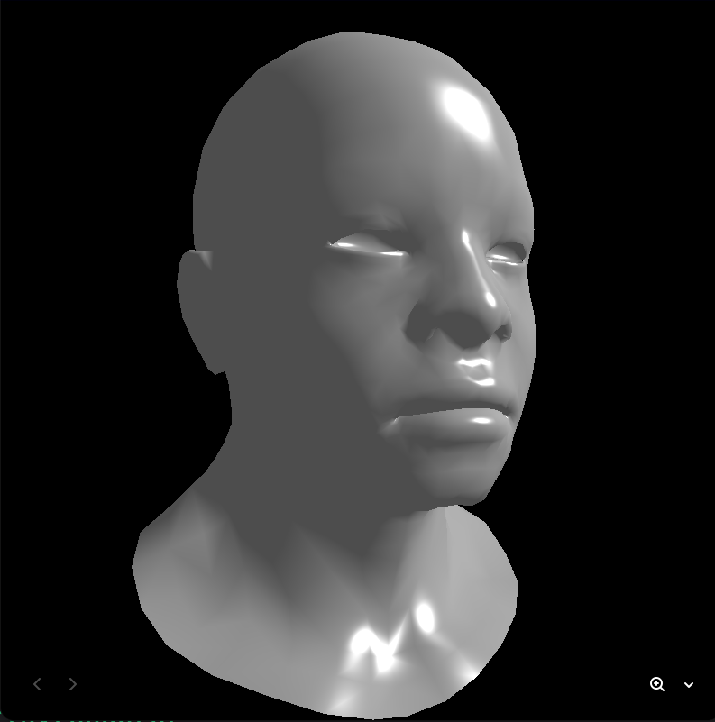

# 3D Renderer

A from-scratch software 3D renderer written in C++ — no OpenGL, no GPU, no graphics libraries. Everything from vertex transformation to per-pixel shading is implemented manually on the CPU.

The project follows the well-known [tinyrenderer](https://github.com/ssloy/tinyrenderer) course by Dmitry V. Sokolov and builds up the classic rendering pipeline one stage at a time.




## Features

- **Wavefront `.obj` loader** — parses vertices, normals and faces (supports `v`, `v//vn`, `v/vt/vn` formats)
- **Camera model** — `lookat` view transform from eye / center / up vectors
- **Perspective projection** using homogeneous coordinates
- **Viewport transform** — clip space → screen space
- **Phong shading** — ambient, diffuse and specular components
- **Z-buffer** depth testing
- **Backface culling** and barycentric-coordinate rasterization with a bounding box
- **OpenMP** parallelism over scanlines (optional, detected automatically)
- **TGA** image output

## Requirements

- A C++20 compiler (GCC, Clang or MSVC)
- CMake ≥ 3.12
- OpenMP (optional — enabled automatically if available)

## Build

```sh
cmake -S . -B build
cmake --build build
```

## Usage

```sh
./build/tinyrenderer assets/african_head.obj
```

You can pass multiple models; each is rendered into the same framebuffer:

```sh
./build/tinyrenderer assets/african_head.obj assets/diablo3_pose.obj
```

The result is written to `framebuffer.tga` in the current directory. View it with any TGA-capable image viewer (e.g. ImageMagick's `display` or GIMP).

## Project structure

```
.
├── assets/                       # 3D model files (.obj)
├── docs/                         # README assets
├── geometry.h                    # vectors & matrices (template math library)
├── model.{h,cpp}                 # .obj model loader
├── our_gl.{h,cpp}                # pipeline: matrices, rasterizer, z-buffer
├── tgaimage.{h,cpp}              # minimal TGA read/write
├── shapes_drawing_alghorithms.*  # line & triangle drawing primitives
├── drawing_utils.*               # wireframe / line-based drawing helpers
└── main.cpp                      # Phong shader + render loop
```

## How it works

1. `lookat` builds the model-view matrix, placing the camera at the eye position looking at the target.
2. `init_perspective` and `init_viewport` build the projection and viewport matrices.
3. For every triangle in the model, vertices are transformed to clip space, then rasterized using barycentric coordinates.
4. Per-pixel depth is tested against the z-buffer, and the `PhongShader` computes the final color from the interpolated normal and light direction.

## Acknowledgements

Based on the [tinyrenderer](https://github.com/ssloy/tinyrenderer) course by Dmitry V. Sokolov.
